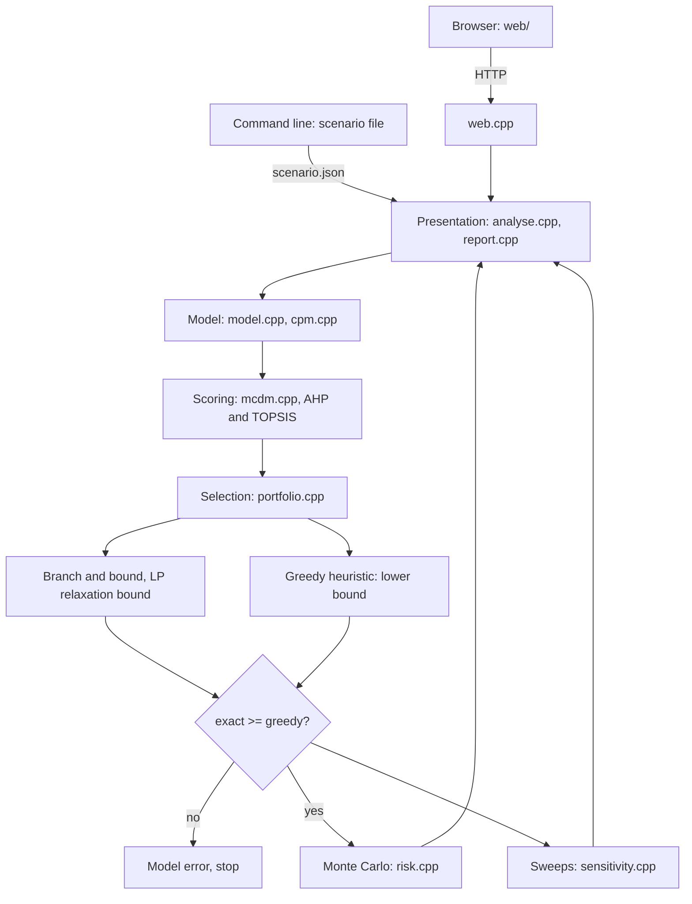

# Quorum

Course project for **Information Technologies for Business Management**, MEng in Computer and
Software Engineering, Faculty of Computer Systems and Technologies, Technical University of Sofia.

## What it is

Quorum is a decision support system for choosing which IT projects an organisation should fund,
and in what order, when there is not enough budget or capacity for all of them. It takes a business
process described as a graph of activities with costs, durations and dependencies, scores the
candidate projects against several criteria at once, and selects the portfolio that maximises total
value within the stated limits. It then re-runs the selection across a range of assumptions so you
can see which choices are stable and which only hold under one particular budget.

The point is not to replace the manager's judgement. The point is to make the recommendation
reproducible: every assumption lives in a file you can version and diff, and every rejected project
comes back with the constraint that rejected it.

## What it does

- **Process model.** Activities with three-point durations, three-point costs, per-period resource
  demand and precedence edges, loaded from one JSON document and validated on the way in. A cycle,
  an unknown identifier or an out-of-order estimate is rejected with the offending element named.
- **Critical path method.** Forward and backward pass, earliest and latest start and finish, total
  float, and the critical path itself. The same code runs on activities inside a project and on
  projects inside the funded programme.
- **PERT.** Three-point estimates give an expected duration, a variance on the critical path, and a
  probability of finishing by a given date from the normal approximation.
- **Multi-criteria analysis, twice.** The analytic hierarchy process derives criteria weights from a
  pairwise judgement matrix, reports the consistency ratio and refuses a matrix above the 0.10
  threshold. TOPSIS ranks by relative closeness to the ideal point. Both run on the same input and
  the report shows where they disagree.
- **Portfolio selection.** Branch and bound with a linear relaxation bound, under a budget, several
  resource capacities, funding prerequisites and mutual exclusions. A greedy heuristic runs beside
  it as a control value: an exact solver that returns less than a feasible heuristic is wrong, not
  slow, and the run stops.
- **Risk.** Monte Carlo over the cost and duration estimates of the funded portfolio, producing a
  confidence interval on total cost and on the completion date.
- **Sensitivity.** Sweeps of the criteria weights and of the budget, reporting for each project
  whether its place in the portfolio is stable or knife-edge.

## Technologies

| Technology | Version or standard | Why |
| --- | --- | --- |
| C++20 | ISO/IEC 14882:2020 | Sensitivity analysis re-solves the same model hundreds of times, so solve time matters. |
| CMake | 3.20 or newer | The whole build, no package manager, no configure-time download. |
| HTTP/1.1 | RFC 9112 | The same process serves the page and the analysis JSON. Parsed in project code. |
| HTML, CSS, JS | in-tree, no package | The browser client. No npm, no framework, no second solver. |
| LaTeX (pdfLaTeX) | TeX Live 2023 or newer | The report format is normative for the faculty and the template targets pdfLaTeX. |

There are **no third-party dependencies**. Not the solver, not the JSON reader, not the test
framework, not the HTTP server, not the page. A stranger with a C++20 compiler and CMake can clone
this and build it first time, and that is worth more than any library this project would otherwise
have pulled in. The JSON reader is `src/json.cpp`, the branch and bound is `src/portfolio.cpp`,
the HTTP parser is `src/http.cpp`, and the test runner is `tests/check.hpp`.

## Architecture

Four layers with a one-way dependency chain. The model layer holds the process graph and the
candidate projects and depends on nothing. The scoring layer turns criteria into one number per
project. The selection layer builds and solves the integer program. The presentation layer accepts
a scenario, drives the other three, and returns the result together with the explanation of why
each project was kept or dropped. The command line prints that result as text. The same process
can serve a static page that posts the scenario and renders the JSON. The boundaries sit where
they do because scoring and selection each have more than one implementation from day one.



## Build

Verified on Windows 11 with g++ 15.2.0 (MinGW-w64), CMake 4.3.2 and Ninja 1.13.2. The exact
commands, as run:

```bash
cmake -S . -B build -G Ninja -DCMAKE_BUILD_TYPE=Release
cmake --build build
ctest --test-dir build --output-on-failure
```

`-G Ninja` is a convenience, not a requirement; the default generator works too.

## Run

```bash
# the whole pipeline on the bundled scenario: rankings, portfolio, schedule,
# Monte Carlo and both sensitivity sweeps
./build/quorum demo

# or, through the build system, from any directory
cmake --build build --target demo

# individual stages
./build/quorum solve       scenarios/example.json --method topsis
./build/quorum sensitivity scenarios/example.json
./build/quorum risk        scenarios/example.json --samples 100000

# the measurements quoted in the report
./build/quorum bench

# the decision-support page, same engine as the commands above
./build/quorum serve --port 8080
# then open http://localhost:8080
```

On Windows the binary is `build\quorum.exe`. `--method` takes `ahp` or `topsis` and defaults to
`topsis`. `serve` reads the client files from `web/` and the bundled scenario from
`scenarios/example.json`; `--web` and `--scenario` override those paths.

## Scenario format

One JSON document, described in full in Appendix A of the report. Line comments starting with `//`
are accepted, because a scenario is a document a human maintains and an unexplained number is worse
than a one-character extension to the reader. The shape:

```json
{
  "budget": 1150,
  "criteria":  [ { "id": "roi", "direction": "max" } ],
  "comparisons": [ [1, 0.5], [2, 1] ],
  "resources": [ { "id": "dev", "capacity": 26 } ],
  "projects": [
    {
      "id": "P01",
      "scores": { "roi": 8 },
      "requires": [], "excludes": [],
      "activities": [
        { "id": "a1", "optimistic": 2, "likely": 3, "pessimistic": 5,
          "cost": 20, "depends_on": [], "demand": { "dev": 2 } }
      ]
    }
  ]
}
```

Durations and costs may be given either as a single value (`duration`, `cost`) or as a three-point
estimate. A single value is the case where all three points coincide, so there is no second code
path for it.

## Documentation

The project report lives in `docs/` and is written in Bulgarian, because the subject is taught in
Bulgarian and the layout rules are normative for the faculty. Build it with:

```bash
cd docs
latexmk -pdf Main.tex   # output lands in docs/build/Main.pdf
```

Formatting follows the TU-Sofia FKST rules, carried over unchanged in `docs/preamble.tex`. Unfilled
facts are marked in red with `\TODO{...}` and can be listed with `grep -rn TODO docs/`.

## Status

- [x] Repository scaffold
- [x] Report skeleton with all chapters and the reference list
- [x] Scenario JSON reader and schema validation
- [x] Model layer: graph, invariants, critical path, PERT
- [x] Scoring layer: AHP with the consistency ratio
- [x] Scoring layer: TOPSIS
- [x] Selection layer: greedy heuristic
- [x] Selection layer: branch and bound with a linear relaxation bound
- [x] Monte Carlo risk analysis
- [x] Sensitivity sweeps over the weights and the budget
- [x] Test suite, 83 cases across 9 suites plus the demo, registered with CTest
- [x] Experiments run and results written up
- [x] Web front end: static HTML/CSS/JS served by the same process

The page loads a scenario, shows the recommended portfolio, the constraint that stopped each
rejected project, and the Monte Carlo risk of the funded set. It does not invent figures: every
number on the page is the engine's. It does not track execution, post to a ledger, or talk to an
ERP.

## License

MIT. See [LICENSE](LICENSE).
