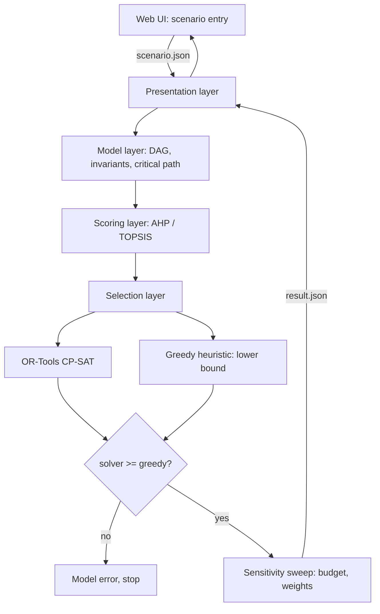

# Quorum

Course project for **Information Technologies for Business Management**, MEng in Computer and
Software Engineering, Faculty of Computer Systems and Technologies, Technical University of Sofia.

## What it is

Quorum is a decision support system for choosing which IT projects an organisation should fund,
and in what order, when there is not enough budget or capacity for all of them. It takes a business
process described as a graph of activities with costs, durations and dependencies, scores the
candidate projects against several criteria at once, and selects the portfolio that maximises total
value within the stated limits. It then re-runs the selection across a range of assumptions so you
can see which choices are stable and which only hold under one particular budget.

The point is not to replace the manager's judgement. The point is to make the recommendation
reproducible: every assumption lives in a file you can version and diff, and every rejected project
comes back with the constraint that rejected it.

## Goals

- Model a business process as a directed acyclic graph of activities with cost, duration and
  per-period resource demand, and reject cyclic input at load time with a pointer to the offending edge.
- Score candidate projects with two independent multi-criteria methods, AHP and TOPSIS, and report
  where their rankings disagree instead of hiding the disagreement behind one number.
- Solve portfolio selection exactly under budget, per-period capacity and precedence constraints.
- Cross-check every solver result against a greedy heuristic lower bound, and fail loudly if the
  solver returns something worse.
- Produce a sensitivity report that separates the portfolio positions that survive every assumption
  change from the ones that do not.
- Keep scenario input and result output as versionable JSON documents with a fixed schema.

## Technologies

| Technology | Version or standard | Why |
| --- | --- | --- |
| C++20 | ISO/IEC 14882:2020 | Sensitivity analysis re-solves the same model hundreds of times, so solve time matters. |
| CMake | 3.24 or newer | `FetchContent` pulls the dependencies without a vendored tree. |
| OR-Tools CP-SAT | 9.x | Exact integer programming with multi-dimensional and precedence constraints, first-class C++ API. |
| nlohmann/json | 3.11 or newer | Scenario and result documents are plain JSON; header-only, nothing to link. |
| GoogleTest | 1.14 or newer | Unit tests for the graph, scoring and model-building code. |
| Plain HTML and JavaScript | ES2020 | Scenario entry and result display. No build step, no framework, no bundler. |
| LaTeX (pdfLaTeX) | TeX Live 2023 or newer | The report format is normative for the faculty and the template targets pdfLaTeX. |

## Architecture

Four layers with a one-way dependency chain. The model layer holds the process graph and the
candidate projects and depends on nothing. The scoring layer turns criteria into one number per
project. The selection layer builds and solves the integer program. The presentation layer accepts
a scenario, drives the other three, and returns the result together with the explanation of why
each project was kept or dropped. The boundaries sit where they do because scoring and selection
each have more than one implementation from day one.



## Build

```bash
git clone <local-path> quorum-it-business-management
cd quorum-it-business-management

cmake -S . -B build -DCMAKE_BUILD_TYPE=Release
cmake --build build -j

ctest --test-dir build --output-on-failure

# solve one scenario
./build/quorum solve scenarios/example.json

# sweep the budget and report which positions are stable
./build/quorum sensitivity scenarios/example.json
```

## Documentation

The project report lives in `docs/` and is written in Bulgarian, because the subject is taught in
Bulgarian and the layout rules are normative for the faculty. Build it with:

```bash
cd docs
latexmk -pdf Main.tex   # output lands in docs/build/Main.pdf
```

Formatting follows the TU-Sofia FKST rules, carried over unchanged in `docs/preamble.tex`. Unfilled
facts are marked in red with `\TODO{...}` and can be listed with `grep -rn TODO docs/`.

## Status

- [x] Repository scaffold
- [x] Report skeleton with all chapters and the reference list
- [ ] Scenario and result JSON schema
- [ ] Model layer: graph, invariants, critical path
- [ ] Scoring layer: AHP
- [ ] Scoring layer: TOPSIS
- [ ] Selection layer: greedy heuristic
- [ ] Selection layer: CP-SAT model
- [ ] Sensitivity sweep
- [ ] Web UI
- [ ] Test suite
- [ ] Experiments run and results written up

Nothing under `src/`, `include/`, `tests/` or `web/` is implemented yet. The build commands above
describe the intended shape, not a working binary.

## License

MIT. See [LICENSE](LICENSE).
